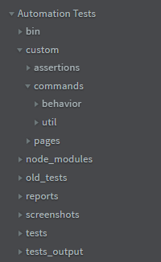

# Folders Structure
Inside the project's folder, we will have some folders that we will use to create our tests, assertions and custom commands.

## /custom
The `/custom` folder will contain our *assertions*, *commands* and *page objects*.

### /custom/assertions
This folder contains our custom *assertions*.

### /custom/commands
The content of this folder is separate in two other folder, `/behavior` and `/util`.

#### /custom/commands/behavior
Its content is separate by page. Contains commands that will check each page behavior.

#### /custom/commands/util
Contains commands that can be used everywhere. If you use the same commands with a high frequence, you can think in create a new command here.

### /custom/pages
This folder contains *Page Objects* files. You can see more details about *page objects* further in this documentation.

## /old_tests
As the name suggests, this folder contains the old tests. The tests inside are separated in Fiscal Year and Quarter.

*PS: A test is considered old not by the date we create them, but when we don't need to run it anymore.*

## /reports
Everytime you run a test it will generate a report inside the `/reports` folder with the id of the test, like `157.xml` as the name of the file.

## /screenshots
If the test returns an error, *Nightwatch.js* will take a screenshot and save at `/screenshots` folder.

*PS: you can also request inside the test to take screenshot of and specific page or step.*

## /tests
Every file inside this folder will be executed. So, every current test should be here.

We will have one file for each test, and the name of this file must be the test id number like `1234.js`.